# RideWise - Class Diagram

This document contains the class diagram for the RideWise Ride Sharing Application using Mermaid syntax.

## Class Diagram

```mermaid
classDiagram
    %% Model Classes
    class User {
        -long id
        -String firstName
        -String lastName
        -String phoneNumber
        -LocalDateTime accountCreatedOn
        +User(long, String, String, String, LocalDateTime)
        +getId() long
        +getFirstName() String
        +getLastName() String
        +getPhoneNumber() String
        +getAccountCreatedOn() LocalDateTime
        +setters()
    }

    class Rider {
        -Map~String,Double~ location
        +Rider(long, String, String, String, LocalDateTime, Map)
        +getLocation() Map~String,Double~
        +setLocation(Map) void
        +toString() String
    }

    class Driver {
        -String licenseNumber
        -boolean isAvailable
        -Vehicle vehicle
        -Map~String,Double~ currentLocation
        -int completedRides
        +Driver(long, String, String, String, LocalDateTime, String, boolean, Vehicle, Map)
        +getLicenseNumber() String
        +isAvailable() boolean
        +getVehicle() Vehicle
        +getCurrentLocation() Map~String,Double~
        +getCompletedRides() int
        +setters()
        +toString() String
    }

    class Vehicle {
        -String licensePlate
        -VehicleType vehicleType
        -String model
        +Vehicle(String, VehicleType, String)
        +getLicensePlate() String
        +getVehicleType() VehicleType
        +getModel() String
        +setters()
    }

    class Ride {
        -long id
        -Rider rider
        -Driver driver
        -Map~String,Double~ startLocation
        -Map~String,Double~ destination
        -RideStatus rideStatus
        -int rideCapacity
        -double fare
        -boolean isPaid
        -LocalDateTime rideCreatedOn
        -LocalDateTime rideEndedOn
        +Ride(long, Rider, Map, Map, RideStatus, double, boolean, LocalDateTime)
        +getters()
        +setters()
        +toString() String
    }

    class FareReceipt {
        -long rideId
        -double amount
        -LocalDateTime generatedOn
        +FareReceipt(long, double, LocalDateTime)
        +getRideId() long
        +getAmount() double
        +getGeneratedOn() LocalDateTime
        +setters()
    }

    %% Enums
    class VehicleType {
        <<enumeration>>
        BIKE
        AUTO
        CAR
    }

    class RideStatus {
        <<enumeration>>
        REQUESTED
        ASSIGNED
        COMPLETED
        CANCELLED
    }

    %% Interfaces
    class FareStrategy {
        <<interface>>
        +calculateFare(Map, Map) double
    }

    class PaymentMethodStrategy {
        <<interface>>
        +pay(double) boolean
    }

    class RideMatchingStrategy {
        <<interface>>
        +findDriver(Ride, List~Driver~) Driver
    }

    %% Strategy Implementations
    class DefaultFareStrategy {
        +calculateFare(Map, Map) double
    }

    class PeakHourFareStrategy {
        +calculateFare(Map, Map) double
    }

    class CashPaymentStrategy {
        +pay(double) boolean
    }

    class UPIPaymentStrategy {
        +pay(double) boolean
    }

    class NearestDriverStrategy {
        +findDriver(Ride, List~Driver~) Driver
    }

    class LeastActiveDriverStrategy {
        +findDriver(Ride, List~Driver~) Driver
    }

    %% Service Classes
    class RiderService {
        -List~Rider~ riders
        +getRiders() List~Rider~
        +setRiders(List) void
        +registerRider(String, String, String) Rider
        +getRiderById(long) Rider
    }

    class DriverService {
        -List~Driver~ drivers
        +getDrivers() List~Driver~
        +setDrivers(List) void
        +getAvailableDrivers(boolean) List~Driver~
        +getDriversByVehicleType(VehicleType) List~Driver~
        +registerDriver(String, String, String, VehicleType) Driver
        +getDriverById(long) Driver
        +setDriverAvailability(long, boolean) void
        +updateDriverLocation(long, Map) void
        +searchForDriver(Ride, RideMatchingStrategy) Driver
    }

    class RideService {
        -Map~RideStatus,Set~Ride~~ rides
        -List~FareReceipt~ fareReceipts
        -FareStrategy fareStrategy
        -RideMatchingStrategy rideMatchingStrategy
        +RideService(FareStrategy, RideMatchingStrategy)
        +requestRide(Rider, Map) Ride
        +assignDriverToRide(Ride, DriverService) void
        +completeRide(long, PaymentMethodStrategy) void
        +cancelRide(long) void
        +findRideById(long) Ride
        +showAllRides() void
        +getters()
        +setters()
    }

    %% Factory Classes
    class RiderFactory {
        <<factory>>
        +createRider(String, String, String)$ Rider
    }

    class DriverFactory {
        <<factory>>
        +createDriver(String, String, String, VehicleType)$ Driver
    }

    class RideFactory {
        <<factory>>
        +createRide(Rider, Map, Map, double)$ Ride
    }

    %% Exception Classes
    class NoDriverFoundException {
        <<exception>>
        +NoDriverFoundException(String)
    }

    class NoRiderFoundException {
        <<exception>>
        +NoRiderFoundException(String)
    }

    %% Utility Classes
    class IdGenerator {
        <<utility>>
        +nextId()$ long
    }

    class Helpers {
        <<utility>>
        +calculateDistance(Map, Map)$ double
        +getRandomRelativeLocation(double)$ Map
        +generateModelName(VehicleType)$ String
        +printSection(String)$ void
    }

    class Constants {
        <<utility>>
        +BASE_FARE$ double
        +PER_KM_RATE$ double
    }

    %% Main Class
    class Main {
        +main(String[])$ void
    }

    %% Relationships - Inheritance
    User <|-- Rider : extends
    User <|-- Driver : extends
    Exception <|-- NoDriverFoundException : extends
    Exception <|-- NoRiderFoundException : extends

    %% Relationships - Implementation
    FareStrategy <|.. DefaultFareStrategy : implements
    FareStrategy <|.. PeakHourFareStrategy : implements
    PaymentMethodStrategy <|.. CashPaymentStrategy : implements
    PaymentMethodStrategy <|.. UPIPaymentStrategy : implements
    RideMatchingStrategy <|.. NearestDriverStrategy : implements
    RideMatchingStrategy <|.. LeastActiveDriverStrategy : implements

    %% Relationships - Composition/Aggregation
    Driver *-- Vehicle : has
    Ride o-- Rider : associated with
    Ride o-- Driver : assigned to
    Ride *-- RideStatus : has
    Vehicle *-- VehicleType : has

    %% Relationships - Dependencies
    RiderService ..> RiderFactory : uses
    DriverService ..> DriverFactory : uses
    RideService ..> RideFactory : uses
    RiderFactory ..> Rider : creates
    DriverFactory ..> Driver : creates
    DriverFactory ..> Vehicle : creates
    RideFactory ..> Ride : creates

    RideService ..> FareStrategy : depends on
    RideService ..> RideMatchingStrategy : depends on
    RideService ..> PaymentMethodStrategy : depends on
    RideService ..> FareReceipt : manages
    RideService ..> Ride : manages
    RiderService ..> Rider : manages
    DriverService ..> Driver : manages

    Main ..> RiderService : uses
    Main ..> DriverService : uses
    Main ..> RideService : uses
    Main ..> FareStrategy : uses
    Main ..> RideMatchingStrategy : uses
    Main ..> PaymentMethodStrategy : uses

    DriverService ..> NoDriverFoundException : throws
    RiderService ..> NoRiderFoundException : throws
    RideService ..> NoDriverFoundException : throws

    RiderFactory ..> IdGenerator : uses
    DriverFactory ..> IdGenerator : uses
    RideFactory ..> IdGenerator : uses
    RiderFactory ..> Helpers : uses
    DriverFactory ..> Helpers : uses
    DefaultFareStrategy ..> Helpers : uses
    DefaultFareStrategy ..> Constants : uses
    NearestDriverStrategy ..> Helpers : uses
```

## Diagram Explanation

### Model Layer
- **User**: Base class for both Rider and Driver containing common user attributes
- **Rider**: Represents a customer requesting rides
- **Driver**: Represents a driver providing rides, contains vehicle and availability information
- **Vehicle**: Represents the driver's vehicle with type and registration details
- **Ride**: Represents a ride request/booking with status, locations, and payment info
- **FareReceipt**: Represents payment receipt after ride completion

### Enums
- **VehicleType**: Defines vehicle categories (BIKE, AUTO, CAR)
- **RideStatus**: Defines ride lifecycle states (REQUESTED, ASSIGNED, COMPLETED, CANCELLED)

### Strategy Pattern (Interfaces)
- **FareStrategy**: Interface for different fare calculation strategies
- **PaymentMethodStrategy**: Interface for different payment methods
- **RideMatchingStrategy**: Interface for different driver matching algorithms

### Strategy Implementations
- **DefaultFareStrategy**: Basic distance-based fare calculation
- **PeakHourFareStrategy**: Fare calculation with peak hour surcharge
- **CashPaymentStrategy**: Cash payment processing
- **UPIPaymentStrategy**: UPI payment processing
- **NearestDriverStrategy**: Matches nearest available driver
- **LeastActiveDriverStrategy**: Matches driver with least completed rides

### Service Layer
- **RiderService**: Manages rider registration and lookup
- **DriverService**: Manages driver registration, availability, and matching
- **RideService**: Manages ride lifecycle (request, assign, complete, cancel)

### Factory Pattern
- **RiderFactory**: Creates Rider instances with auto-generated IDs
- **DriverFactory**: Creates Driver and Vehicle instances
- **RideFactory**: Creates Ride instances

### Exception Handling
- **NoDriverFoundException**: Thrown when no driver is available
- **NoRiderFoundException**: Thrown when rider lookup fails

### Utility Classes
- **IdGenerator**: Generates unique IDs for entities
- **Helpers**: Provides utility methods for distance calculation, location generation, etc.
- **Constants**: Defines application constants like fare rates

### Design Patterns Used
1. **Strategy Pattern**: For fare calculation, payment methods, and driver matching
2. **Factory Pattern**: For creating domain objects (Rider, Driver, Ride)
3. **Service Layer Pattern**: Separates business logic from presentation
4. **Inheritance**: User as base class for Rider and Driver

## Key Relationships
- Riders and Drivers inherit from User
- Each Driver has a Vehicle
- Each Ride is associated with one Rider and one Driver
- Services use Factories to create domain objects
- RideService depends on strategy interfaces for flexible algorithms
- All factories use IdGenerator for unique ID generation

